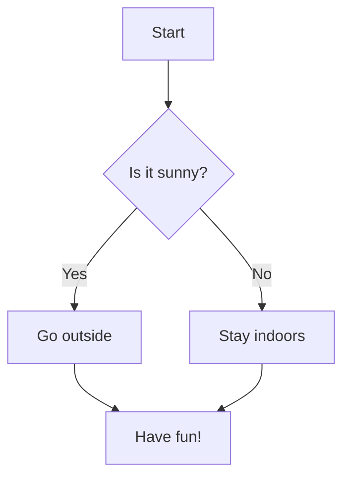

# LearnScripts

Run scripts for simplify daily life

Simple mermaid demo

```mermaid
flowchart TD
    A[Start] --> B{Is it sunny?}
    B -- Yes --> C[Go outside]
    B -- No --> D[Stay indoors]
    C --> E[Have fun!]
    D --> E
```
